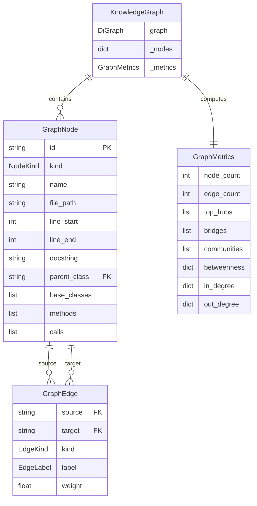
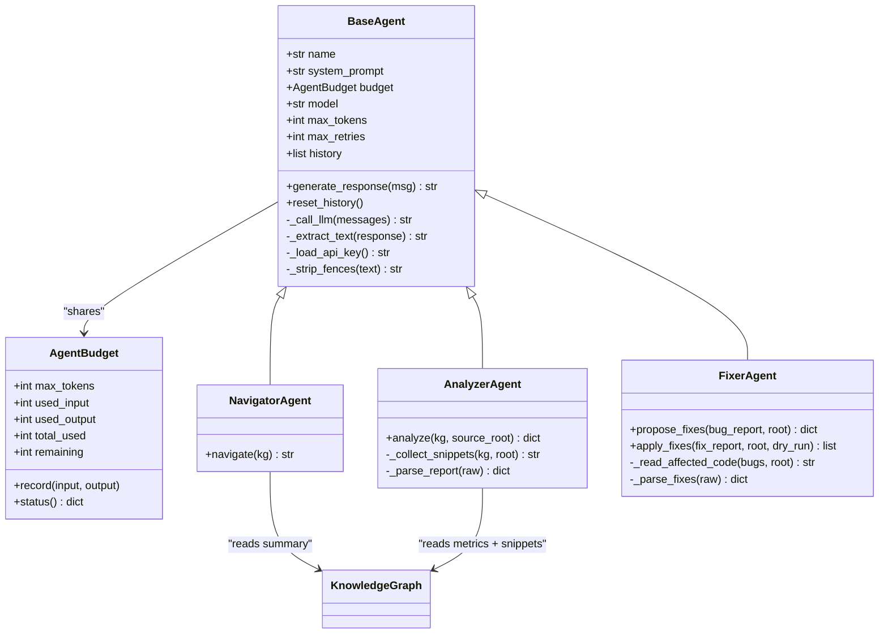
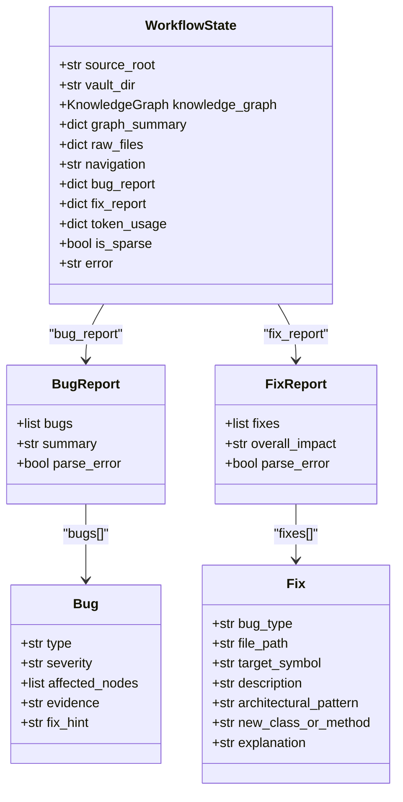
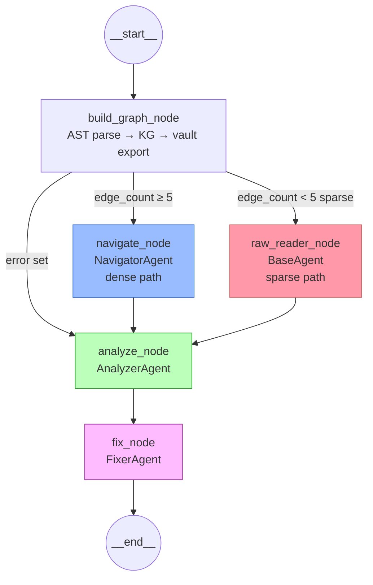
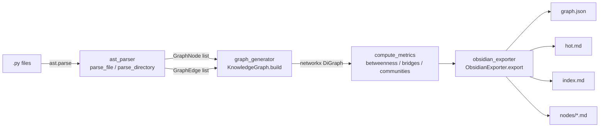
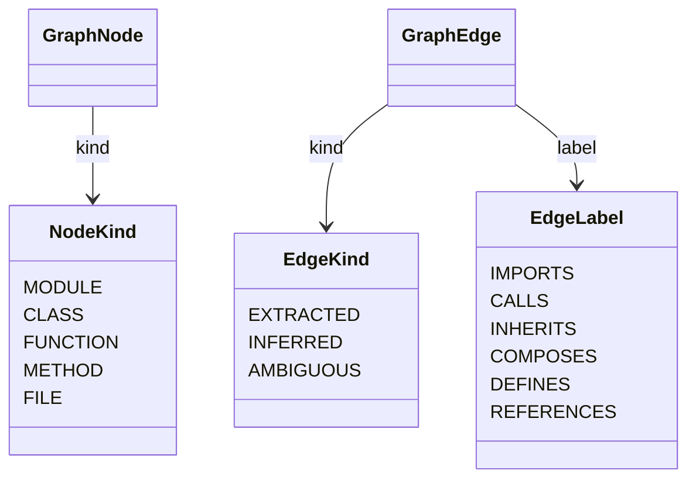
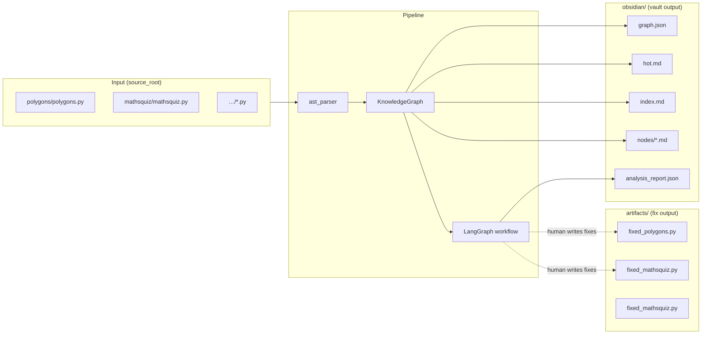

# EX04 — Entity Relationship Diagram

All diagrams are in Mermaid syntax. Render in GitHub, Obsidian, or any Mermaid viewer.

---

## 1. Core Data Models

---

## 2. Agent Hierarchy

---

## 3. LangGraph Workflow State

---

## 4. LangGraph Node Flow

---

## 5. Graph Builder Internals

---

## 6. Enum Values

---

## 7. File → Output Mapping

