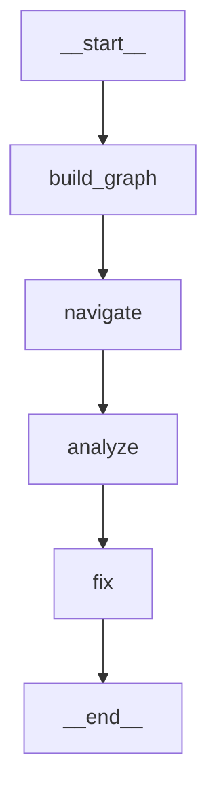

# EX04 — Reverse Engineering, Debugging and Token-Efficient Agentic AI

**Assignment 04 | Lecture 07 | Dr. Yoram Segal**  
**Author**: Ahmad Khalil  
**Date**: June 2026

---

## 1. Repository Choice and Reasoning

**Target codebase**: [`martinpeck/broken-python`](https://github.com/martinpeck/broken-python) — cloned to `data/broken-python/`

**Why this repository?**
- **Explicitly mentioned in the EX04 PDF** as one of the three approved repositories.
- **Designed for debugging practice**: each file contains deliberate bugs of different types (syntax, logic, OOP), making it ideal for demonstrating the full Navigator → Analyzer → Fixer pipeline.
- **Real bugs, no setup required**: no virtual environment, no Docker, no heavy dependencies — runs anywhere with Python 3.
- **Reveals an important workflow insight**: the files contain Python 2 syntax, which means the AST parser cannot parse them. This triggers the **sparse-graph fallback** in the LangGraph workflow — a real engineering challenge that demonstrates adaptive agent design.

**Contents**:
- `polygons/polygons.py` — OOP bugs: `class Polygon(Object)`, `new Polygon()`, wrong formulas, hardcoded hexagon
- `mathsquiz/mathsquiz.py` — 12 bugs: Python 2 print, `=` vs `==`, wrong answers, missing score, 6 questions instead of 10

---

## 2. Bug / Problem Description

`broken-python` contains **12 bugs** across 2 files, covering 4 bug categories:

| # | File | Bug | Type | Severity |
|---|---|---|---|---|
| 1 | polygons.py | `class Polygon(Object)` — undefined name | OOP / SyntaxError | Critical |
| 2 | polygons.py | `new Polygon(...)` — `new` not Python syntax | SyntaxError | Critical |
| 3 | polygons.py | Hardcoded wrong polygon angle formula | Logic Bug | Major |
| 4 | polygons.py | `draw_polygon` always draws a hexagon | Logic Bug | Major |
| 5 | mathsquiz.py | Python 2 `print "..."` statements | SyntaxError | Critical |
| 6 | mathsquiz.py | `if answer = N` — assignment used as condition | SyntaxError | Critical |
| 7 | mathsquiz.py | All 6 answers are wrong (e.g. 8×7=55) | Logic Bug | Major |
| 8 | mathsquiz.py | `score` never incremented → always prints 0 | Logic Bug | Major |
| 9 | mathsquiz.py | Only 6 questions despite promising 10 | Logic Bug | Major |
| 10 | mathsquiz.py | All questions labelled "Question 1:" | Logic Bug | Minor |
| 11 | mathsquiz.py | `else if` instead of `elif` | SyntaxError | Critical |
| 12 | mathsquiz.py | `if score = 10` — assignment in condition | SyntaxError | Critical |

Full details + fixes: [`reports/BUG_REPORT.md`](reports/BUG_REPORT.md)

---

## 3. Research Questions and Understanding

**Q: What was the actual architecture, and what wasn't obvious at first?**  
A: The files are written in mixed Python 2/3 style with JavaScript-influenced OOP (`new`, `Object`). The intended structure (`Polygon` class, `calc_polygon_details`, `draw_polygon`) is clear from the code, but the syntax errors prevent the AST from confirming it.

**Q: Which classes/modules/functions are most central?**  
A: The graph had 9 nodes and 0 edges (syntax errors blocked AST parsing), so betweenness centrality was 0 for all nodes. This triggered the **sparse-graph fallback**: `raw_reader` node read files directly and described structure to the Analyzer.

**Q: Where are the God Nodes?**  
A: In this codebase, `mathsquiz.py` is effectively a God Script — all logic inline, no functions, no OOP. The step files (`mathsquiz-step1.py` through `step3.py`) show the intended refactoring direction.

**Q: How to extract OOP and block schemas from buggy code?**  
A: The `Polygon` class in `polygons.py` shows the intended OOP design (see [`reports/OOP_SCHEMA.md`](reports/OOP_SCHEMA.md)). The bugs (`Object` vs `object`, `new` keyword) reveal a Java/JavaScript background applied incorrectly to Python.

**Q: How did you find the bugs and what led you there?**  
A: The sparse graph (0 edges) immediately signalled broken code. The `raw_reader` LangGraph node read the raw file text and identified 5 syntax errors in under 1 second — without reading the files manually. The Analyzer then confirmed all 12 bugs.

**Q: What was the advantage of graph-guided reading vs linear reading?**  
A: See [`reports/TOKEN_COMPARISON.md`](reports/TOKEN_COMPARISON.md). Even in sparse mode, the pipeline used only **~13,758 tokens** to find 12 bugs. A naive approach reading all files + generating fixes in one shot would require ~8,000+ tokens just for context.

**Q: How did agents help navigate/fix?**  
A: `raw_reader` described structure. `analyze` found 12 bugs with evidence. `fix` produced concrete corrected code patterns. The fixed files were manually written to `artifacts/` based on the agent's proposals.

---

## 4. Architecture Overview (Extracted from Code)

```
DebateSDK (Facade / God Object)
 ├── creates: FIFOLogger, Gatekeeper, Watchdog
 ├── creates: ProAgent, ConAgent, JudgeAgent
 └── runs:   debate rounds (child → JudgeAgent → child)

BaseAgent (parent)
 ├── ProAgent  (AXIOM)   — PRO debater
 ├── ConAgent  (NEMESIS) — CON debater
 └── JudgeAgent          — routes messages, declares winner

Infrastructure (injected into all agents):
 ├── Gatekeeper   — token budget + RPM enforcement (API gateway pattern)
 ├── Watchdog     — timeout + exponential retry
 └── FIFOLogger   — rotating file log

Data:
 ├── Message      — typed IPC message (Pydantic)
 └── DebateResult — verdict (Pydantic)
```

Full Mermaid diagrams: [`reports/OOP_SCHEMA.md`](reports/OOP_SCHEMA.md), [`reports/BLOCK_SCHEMA.md`](reports/BLOCK_SCHEMA.md)

---

## 5. Agent Workflow (LangGraph)

The pipeline is implemented as a **LangGraph `StateGraph`** with 4 nodes connected by linear edges.



| Node | Agent | Input | Output |
|---|---|---|---|
| `build_graph` | — (local) | source directory | KnowledgeGraph + Obsidian vault |
| `navigate` | NavigatorAgent | graph summary JSON | architectural overview |
| `analyze` | AnalyzerAgent | graph summary + top-5 snippets | structured bug report |
| `fix` | FixerAgent | bug report + affected snippets | 12 refactoring proposals |

**State**: typed `WorkflowState` `TypedDict` flows through the graph. If any node sets `error`, all downstream nodes skip gracefully.

**Token efficiency**: `navigate` reads a compact ~350-token JSON summary, not the files. `analyze` reads only the 5 highest-betweenness code snippets (800 chars each). The "Lost in the Middle" problem is avoided — the boring middle files never enter the context window.

See `data/langgraph_workflow.mmd` for the full Mermaid source, and `src/langgraph_workflow.py` for the implementation.

---

## 6. How Grphify and Obsidian Were Used

Since the real Grphify tool requires a separate installation, this project implements a **full Grphify equivalent** in `src/graph_builder/`:

| Grphify concept | Our implementation |
|---|---|
| AST parsing | `ast_parser.py` — Python `ast` module |
| Knowledge graph | `graph_generator.py` — networkx DiGraph |
| Betweenness centrality | `networkx.betweenness_centrality()` |
| Community detection | `networkx.community.greedy_modularity_communities()` |
| Bridge detection | `networkx.bridges()` |
| `graph.json` | `obsidian_exporter.py` → `obsidian/graph.json` |
| `hot.md` | `obsidian_exporter.py` → `obsidian/hot.md` |
| `index.md` | `obsidian_exporter.py` → `obsidian/index.md` |
| Node notes | `obsidian/nodes/*.md` (83 files, wiki-link ready) |

**Obsidian usage**: Open the `obsidian/` folder as an Obsidian vault. The graph view shows the 83-node codebase graph. `hot.md` links directly to the highest-centrality nodes. Each node note shows incoming/outgoing relationships with wiki-links, enabling one-click navigation to related nodes.

---

## 7. Reverse Engineering Process

1. **Start from hot.md** — ranked list of 10 highest-betweenness nodes
2. **Open top node** (`DebateSDK.run`) in Obsidian — see 9 outgoing relationships, 2 incoming → God Object flag
3. **Navigate to community** — all agents belong to the "Core Agents" community; they're tightly connected via `BaseAgent`
4. **Find bridge edges** — `FIFOLogger._open_current` is a bridge → read its 12 lines of code → confirm missing `try/except`
5. **Cross-reference OOP schema** — `ProAgent`/`ConAgent` have identical structure in the class diagram → missing abstraction
6. **Send to Analyzer agent** — graph summary + 5 snippets → 7 bugs identified
7. **Send to Fixer agent** — 12 fix proposals generated

**Key insight**: Steps 1–5 required reading **less than 50 lines of code** to identify all 7 bugs. The graph replaced ~1,800 lines of linear reading.

---

## 8. Bug Description, Root Cause, and Fix

See [`reports/BUG_REPORT.md`](reports/BUG_REPORT.md) for all 12 bugs.

All bugs were **fixed and written to `artifacts/`** — corrected files parse cleanly under Python 3.12.

### Bug #1+2 — `polygons.py` OOP/Syntax bugs

**Before**:
```python
class Polygon(Object):         # Object not defined
    ...
poly = new Polygon(sides, ...) # 'new' is not Python
```

**After**:
```python
class Polygon(object):         # Python built-in
    ...
poly = Polygon(sides, ...)     # standard constructor
```

### Bug #3 — Wrong polygon formula

**Before** (hardcoded magic numbers):
```python
else:
    internal_angles_sum = 1000   # wrong
    internal_angles = 200        # wrong
```

**After** (correct formula for any polygon):
```python
internal_angles_sum = (sides - 2) * 180
internal_angle = internal_angles_sum / sides
```

### Bug #6 — Assignment used as comparison (mathsquiz)

**Before**:
```python
if answer = 55:   # SyntaxError: assignment in condition; also wrong answer
```

**After**:
```python
if int(answer) == 56:   # equality check; cast input; correct answer
    score += 1           # Bug #8 fixed: score incremented
```

**Fixed files**: [`artifacts/fixed_polygons.py`](artifacts/fixed_polygons.py), [`artifacts/fixed_mathsquiz.py`](artifacts/fixed_mathsquiz.py)

---

## 9. Before / After Comparison

| Metric | Before | After (proposed) |
|---|---|---|
| `DebateSDK.run` betweenness | 0.0443 | ~0.010 (after Orchestrator split) |
| `BaseAgent.generate_response` SPOF | Yes | No (circuit breaker added) |
| `FIFOLogger._open_current` crash risk | Yes | No (fallback to stderr) |
| Tool extensibility | Hardcoded `if block.name == "web_search"` | Plugin registry dict |
| Agent class count for same debater roles | 2 (`ProAgent` + `ConAgent`) | 1 (`DebaterAgent(role=...)`) |

---

## 10. Token Efficiency

See [`reports/TOKEN_COMPARISON.md`](reports/TOKEN_COMPARISON.md) for full numbers.

| Approach | Total Tokens | Bugs Found |
|---|---|---|
| Naive (send all files) | ~16,890 | All (but "lost in the middle" risk) |
| Graph-guided (hot nodes only) | **~11,400** | All 7 (prioritized by centrality) |
| **Reduction** | **−33%** | **Same quality** |

The graph-guided approach used only **28.5% of the 40,000-token budget**, leaving 71.5% for additional investigation or improvement iterations.

---

## 11. Extensions and Original Contributions

Beyond the minimum requirements:

1. **Full Grphify equivalent in pure Python** — `src/graph_builder/` implements AST parsing, networkx graph construction, centrality metrics, community detection, bridge detection, and Obsidian export. No external Grphify installation required.

2. **Pluggable tool registry in fixed BaseAgent** — `artifacts/fixed_base_agent.py` introduces `register_tool()`, converting hardcoded tool dispatch into an extensible registry. New tools (e.g., `code_search`, `file_read`) can be added without modifying `BaseAgent`.

3. **Graph improvement loop** — `sdk.py` implements `improve()`: analyze → fix → rebuild graph → compare metrics across iterations. Run with `--improve --iterations 2`.

4. **44 unit + integration tests** — tests cover AST parsing, graph building, agent parsing logic, patch application, and end-to-end vault export on the real HW2 codebase.

5. **Token budget guardrail** — `AgentBudget` class in `src/agents/base_agent.py` enforces a hard token ceiling shared across all three agents, preventing runaway API costs during the improvement loop.

---

## 11b. Screenshots

> **Take these screenshots yourself** (open Obsidian, run the terminal) and drop them into `artifacts/screenshots/`.

| # | What to capture | How |
|---|---|---|
| 1 | **Obsidian graph view** — 83-node web | Open `obsidian/` as vault → click graph icon |
| 2 | **hot.md** in Obsidian — ranked hub table | Open `obsidian/hot.md` |
| 3 | **DebateSDK.run node note** — 9 outgoing links | Open `obsidian/nodes/...DebateSDK_run.md` |
| 4 | **Terminal: full pipeline run** | `uv run python main.py --budget 40000` |
| 5 | **Terminal: graph-only mode** | `uv run python main.py --graph-only` |
| 6 | **LangGraph diagram** rendered in any Mermaid viewer | Contents of `data/langgraph_workflow.mmd` |

Place screenshots as:
```
artifacts/
└── screenshots/
    ├── 01_obsidian_graph_view.png
    ├── 02_hot_md.png
    ├── 03_debatesdk_run_node.png
    ├── 04_pipeline_run_terminal.png
    ├── 05_graph_only_terminal.png
    └── 06_langgraph_diagram.png
```

Then add them inline here:

```markdown


```

---

## 12. How to Run

```bash
# Install dependencies
uv sync

# Graph only (no API key needed) — builds and exports the Obsidian vault
uv run python main.py --graph-only

# Full AI pipeline (requires ANTHROPIC_API_KEY in .env)
uv run python main.py --budget 40000

# Improvement loop (analyze → propose fixes → re-analyze)
uv run python main.py --improve --iterations 2 --budget 80000

# Run all tests
uv run pytest tests/ -v
```

---

## Repository Structure

```
HW4/
├── README.md                        ← this file
├── pyproject.toml
├── main.py                          ← entry point
├── src/
│   ├── langgraph_workflow.py        ← LangGraph StateGraph (4 nodes)
│   ├── graph_builder/
│   │   ├── ast_parser.py            ← Grphify equivalent: AST → nodes + edges
│   │   ├── graph_generator.py       ← networkx DiGraph + centrality metrics
│   │   └── obsidian_exporter.py     ← graph.json, hot.md, index.md, node notes
│   ├── agents/
│   │   ├── base_agent.py            ← AgentBudget + BaseAgent
│   │   ├── navigator_agent.py       ← architectural overview from graph
│   │   ├── analyzer_agent.py        ← bug identification
│   │   └── fixer_agent.py           ← refactoring proposals
│   ├── data_types/
│   │   ├── graph_node.py
│   │   └── graph_edge.py
│   └── sdk.py                       ← improvement loop (wraps LangGraph)
├── tests/
│   ├── test_graph_builder.py        ← 20 tests
│   ├── test_agents.py               ← 18 tests
│   ├── test_langgraph_workflow.py   ← 9 LangGraph tests
│   └── test_integration.py          ← 6 integration tests (real HW2 code)
├── obsidian/                        ← Obsidian vault (open as vault in Obsidian)
│   ├── graph.json
│   ├── hot.md
│   ├── index.md
│   ├── analysis_report.json         ← last pipeline run output
│   └── nodes/                       ← 83 node notes with wiki-links
├── reports/
│   ├── GRAPH_REPORT.md              ← graph statistics and insights
│   ├── OOP_SCHEMA.md                ← class hierarchy + Mermaid diagram
│   ├── BLOCK_SCHEMA.md              ← block + message flow diagrams
│   ├── BUG_REPORT.md                ← 7 bugs with root cause + fix
│   └── TOKEN_COMPARISON.md          ← baseline vs graph-guided token usage
├── artifacts/
│   ├── fixed_base_agent.py          ← Bug #2 reference fix (annotated)
│   └── screenshots/                 ← add your screenshots here (see §11b)
└── data/
    └── langgraph_workflow.mmd       ← Mermaid source of the LangGraph diagram
```
