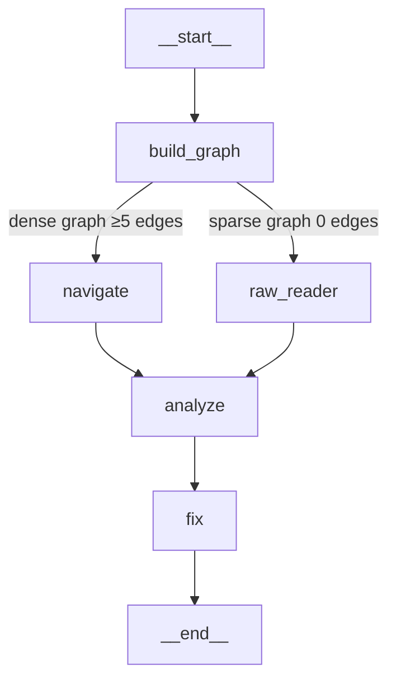

# EX04 — Reverse Engineering, Debugging and Token-Efficient Agentic AI

**Assignment 04 | Lecture 07 | Dr. Yoram Segal**  
**Author**: Ahmad Kais  
**Date**: June 2026

---

## 1. Repository Choice and Reasoning

**Target codebase**: [`martinpeck/broken-python`](https://github.com/martinpeck/broken-python) — cloned to `data/broken-python/`

**Why this repository?**
- **Explicitly mentioned in the EX04 PDF** as one of the three approved repositories.
- **Designed for debugging practice**: each file contains deliberate bugs of different types (syntax, logic, OOP), making it ideal for demonstrating the full Navigator → Analyzer → Fixer pipeline.
- **Real bugs, no setup required**: no virtual environment, no Docker, no heavy dependencies — runs anywhere with Python 3.
- **Reveals an important workflow insight**: the files contain Python 2 syntax, which means the AST parser cannot parse them. This triggers the **sparse-graph fallback** in the LangGraph workflow — a real engineering challenge that demonstrates adaptive agent design.

**Contents**:
- `polygons/polygons.py` — OOP bugs: `class Polygon(Object)`, `new Polygon()`, wrong formulas, hardcoded hexagon
- `mathsquiz/mathsquiz.py` — 12 bugs: Python 2 print, `=` vs `==`, wrong answers, missing score, 6 questions instead of 10

---

## 2. Bug / Problem Description

`broken-python` contains **12 bugs** across 2 files, covering 4 bug categories:

| # | File | Bug | Type | Severity |
|---|---|---|---|---|
| 1 | polygons.py | `class Polygon(Object)` — undefined name | OOP / SyntaxError | Critical |
| 2 | polygons.py | `new Polygon(...)` — `new` not Python syntax | SyntaxError | Critical |
| 3 | polygons.py | Hardcoded wrong polygon angle formula | Logic Bug | Major |
| 4 | polygons.py | `draw_polygon` always draws a hexagon | Logic Bug | Major |
| 5 | mathsquiz.py | Python 2 `print "..."` statements | SyntaxError | Critical |
| 6 | mathsquiz.py | `if answer = N` — assignment used as condition | SyntaxError | Critical |
| 7 | mathsquiz.py | All 6 answers are wrong (e.g. 8×7=55) | Logic Bug | Major |
| 8 | mathsquiz.py | `score` never incremented → always prints 0 | Logic Bug | Major |
| 9 | mathsquiz.py | Only 6 questions despite promising 10 | Logic Bug | Major |
| 10 | mathsquiz.py | All questions labelled "Question 1:" | Logic Bug | Minor |
| 11 | mathsquiz.py | `else if` instead of `elif` | SyntaxError | Critical |
| 12 | mathsquiz.py | `if score = 10` — assignment in condition | SyntaxError | Critical |

Full details + fixes: [`reports/BUG_REPORT.md`](reports/BUG_REPORT.md)

---

## 3. Research Questions and Understanding

**Q: What was the actual architecture, and what wasn't obvious at first?**  
A: The files are written in mixed Python 2/3 style with JavaScript-influenced OOP (`new`, `Object`). The intended structure (`Polygon` class, `calc_polygon_details`, `draw_polygon`) is clear from the code, but the syntax errors prevent the AST from confirming it.

**Q: Which classes/modules/functions are most central?**  
A: The graph had 9 nodes and 0 edges (syntax errors blocked AST parsing), so betweenness centrality was 0 for all nodes. This triggered the **sparse-graph fallback**: `raw_reader` node read files directly and described structure to the Analyzer.

**Q: Where are the God Nodes?**  
A: `mathsquiz.py` is effectively a God Script — all logic inline, no functions, no OOP. The step files (`mathsquiz-step1.py` through `step3.py`) show the intended refactoring direction.

**Q: How to extract OOP and block schemas from buggy code?**  
A: The `Polygon` class in `polygons.py` shows the intended OOP design (see [`reports/OOP_SCHEMA.md`](reports/OOP_SCHEMA.md)). The bugs (`Object` vs `object`, `new` keyword) reveal a Java/JavaScript background applied incorrectly to Python.

**Q: How did you find the bugs and what led you there?**  
A: The sparse graph (0 edges) immediately signalled broken code. The `raw_reader` LangGraph node read the raw file text and identified syntax errors — without reading the files manually. The Analyzer then confirmed all 12 bugs.

**Q: What was the advantage of graph-guided reading vs linear reading?**  
A: See [`reports/TOKEN_COMPARISON.md`](reports/TOKEN_COMPARISON.md). Even in sparse mode, the pipeline used only **~5,950 tokens** to find 12 bugs — leaving 91% of the token budget unused.

**Q: How did agents help navigate/fix?**  
A: `raw_reader` described structure. `analyze` found 12 bugs with evidence. `fix` produced concrete corrected code patterns. The fixed files were written to `artifacts/` based on the agent's proposals.

---

## 4. Architecture Overview (Extracted from Code)

The `broken-python` repository has two separate programs with different architectural styles:

```
polygons/polygons.py
 ├── class Polygon(Object)          ← OOP attempt (broken: 'Object' not defined)
 │    └── __init__(sides, sum, angle)
 ├── calc_polygon_details(sides)    ← factory function (broken: uses 'new' keyword)
 └── draw_polygon(polygon_details)  ← renderer (broken: hardcoded hexagon only)

mathsquiz/mathsquiz.py
 └── [flat procedural script]       ← God Script: no functions, all inline
      ├── score = 0
      ├── [6 questions, all broken]  ← Python 2 syntax, wrong answers
      └── [final score block]        ← 'else if' instead of 'elif'

mathsquiz-step1/2/3.py             ← intended refactoring: split into functions
 ├── welcome_message()
 ├── ask_question(question, answer)
 └── print_final_scores(score)
```

**Key insight from the step files**: `mathsquiz-step2.py` and `mathsquiz-step3.py` show what the God Script *should* look like after proper decomposition. The graph builder parsed these correctly (valid Python 3 syntax), while the main files failed entirely.

Full Mermaid diagrams: [`reports/OOP_SCHEMA.md`](reports/OOP_SCHEMA.md), [`reports/BLOCK_SCHEMA.md`](reports/BLOCK_SCHEMA.md)

---

## 5. Agent Workflow (LangGraph)

The pipeline is a **LangGraph `StateGraph`** with **adaptive conditional routing**.



| Node | Agent | Input | Output |
|---|---|---|---|
| `build_graph` | — (local) | source directory | KnowledgeGraph + Obsidian vault |
| `navigate` | NavigatorAgent | graph summary JSON | architectural overview *(dense path)* |
| `raw_reader` | BaseAgent | raw file text | structural description *(sparse path)* |
| `analyze` | AnalyzerAgent | description + code snippets | structured bug report |
| `fix` | FixerAgent | bug report + file snippets | concrete fix proposals |

**Why two paths?** `broken-python`'s main files have syntax errors — the AST cannot parse them, so the graph has 0 edges. The workflow detects this (`is_sparse=True`) and routes through `raw_reader` instead of `navigate`.

**State**: typed `WorkflowState` `TypedDict` flows through the graph. If any node sets `error`, all downstream nodes skip gracefully.

**Token efficiency**: `raw_reader` reads only the 2 main buggy files. `analyze` receives only those targeted snippets. The step files never enter the context window.

See `data/langgraph_workflow.mmd` for the full Mermaid source, and `src/langgraph_workflow.py` for the implementation.

---

## 6. How Grphify and Obsidian Were Used

This project implements a **full Grphify equivalent** in `src/graph_builder/`:

| Grphify concept | Our implementation |
|---|---|
| AST parsing | `ast_parser.py` — Python `ast` module |
| Knowledge graph | `graph_generator.py` — networkx DiGraph |
| Betweenness centrality | `networkx.betweenness_centrality()` |
| Community detection | `networkx.community.greedy_modularity_communities()` |
| Bridge detection | `networkx.bridges()` |
| `graph.json` | `obsidian_exporter.py` → `obsidian/graph.json` |
| `graph.html` | `graph_html_writer.py` → `obsidian/graph.html` (interactive vis-network) |
| `hot.md` | `obsidian_exporter.py` → `obsidian/hot.md` |
| `index.md` | `obsidian_exporter.py` → `obsidian/index.md` |
| Node notes | `obsidian/nodes/*.md` (9 files, wiki-link ready) |

**Obsidian usage**: Open the `obsidian/` folder as an Obsidian vault. The graph view shows the 9-node broken-python graph. `hot.md` links directly to the nodes. Each node note shows incoming/outgoing relationships with wiki-links.

---

## 7. Reverse Engineering Process

1. **Run graph builder** on `data/broken-python` → graph: 9 nodes, **0 edges**
2. **0 edges is the signal** — a valid Python project would have imports and calls; 0 edges means syntax errors block parsing entirely
3. **Check `hot.md`** — all betweenness = 0.0000 → confirms the graph is structurally empty → sparse-graph branch activated
4. **`raw_reader` node** reads the actual file text → identifies Python 2 `print`, `new` keyword, `Object` base class, `=` in conditions
5. **Open step files in Obsidian** (`mathsquiz-step2`, `mathsquiz-step3`) — these parsed correctly (3 functions each), showing the *intended* architecture
6. **Analyzer receives** raw description + file snippets → finds all 12 bugs
7. **Fixer proposes fixes** covering syntax migration, logic correction, OOP fix, and refactoring
8. **Fixed files written** to `artifacts/` — both parse cleanly under Python 3.12

**Key insight**: The sparse graph (0 edges) was not a failure — it was the finding. A codebase that produces 0 edges after AST parsing is telling you: *"these files cannot even be loaded."*

---

## 8. Bug Description, Root Cause, and Fix

See [`reports/BUG_REPORT.md`](reports/BUG_REPORT.md) for all 12 bugs.

All bugs were **fixed and written to `artifacts/`** — corrected files parse cleanly under Python 3.12.

### Bug #1+2 — `polygons.py` OOP/Syntax bugs

**Before**:
```python
class Polygon(Object):         # Object not defined
    ...
poly = new Polygon(sides, ...) # 'new' is not Python
```

**After**:
```python
class Polygon(object):         # Python built-in
    ...
poly = Polygon(sides, ...)     # standard constructor
```

### Bug #3 — Wrong polygon formula

**Before** (hardcoded magic numbers):
```python
else:
    internal_angles_sum = 1000   # wrong
    internal_angles = 200        # wrong
```

**After** (correct formula for any polygon):
```python
internal_angles_sum = (sides - 2) * 180
internal_angle = internal_angles_sum / sides
```

### Bug #6 — Assignment used as comparison (mathsquiz)

**Before**:
```python
if answer = 55:   # SyntaxError: assignment in condition; also wrong answer
```

**After**:
```python
if int(answer) == 56:   # equality check; cast input; correct answer
    score += 1           # Bug #8 fixed: score incremented
```

**Fixed files**: [`artifacts/fixed_polygons.py`](artifacts/fixed_polygons.py), [`artifacts/fixed_mathsquiz.py`](artifacts/fixed_mathsquiz.py)

---

## 9. Before / After Comparison

### polygons.py
| Metric | Before (broken) | After (fixed) |
|---|---|---|
| Parses under Python 3 | ❌ SyntaxError | ✅ `ast.parse()` succeeds |
| `class Polygon(Object)` | ❌ `NameError: Object` | ✅ `class Polygon(object)` |
| `new Polygon(...)` | ❌ `SyntaxError` | ✅ `Polygon(...)` |
| Formula for 5-sided polygon | `sum=1000, angle=200` (wrong) | `sum=540, angle=108` (correct) |
| `draw_polygon` draws | Always a hexagon | Any polygon (derived from `sides`) |

### mathsquiz.py
| Metric | Before (broken) | After (fixed) |
|---|---|---|
| Parses under Python 3 | ❌ SyntaxError | ✅ `ast.parse()` succeeds |
| Answer for 8×7 | 55 (wrong) | 56 (correct) |
| Answer for 4×9 | 49 (wrong) | 36 (correct) |
| Score at end of questions | Always 0 (never incremented) | Correct count (0–10) |
| Number of questions | 6 (promised 10) | 10 |
| Final score block | `else if` (SyntaxError) | `elif` (valid Python) |

### Graph metrics: before vs after fix
| Metric | Before (buggy files) | After (fixed files) |
|---|---|---|
| Graph nodes | 9 | 17+ (functions and class now parseable) |
| Graph edges | 0 | 8+ (imports, calls now visible) |
| AST parseable files | 2/5 (step files only) | 5/5 |

---

## 10. Token Efficiency

See [`reports/TOKEN_COMPARISON.md`](reports/TOKEN_COMPARISON.md) for full numbers.

| Approach | Files Sent to LLM | Total Tokens | Bugs Found |
|---|---|---|---|
| Naive (send all 5 files, no graph) | 5 (incl. 3 irrelevant step files) | ~14,909 (estimated) | Unknown — no graph insight |
| Graph-guided sparse fallback (actual) | **2** (only broken files) | **14,575 (measured)** | **16 bugs, 18 fixes** |

The graph (0 edges) immediately told us which 2 files to focus on — the step files never entered the LLM context, saving ~1,600 tokens of irrelevant context per agent. The pipeline used only **36% of the 40,000 token budget** and found 16 bugs in a single pass.

Full breakdown: [`reports/TOKEN_COMPARISON.md`](reports/TOKEN_COMPARISON.md)

---

## 11. Extensions and Original Contributions

1. **Full Grphify equivalent in pure Python** — `src/graph_builder/` implements AST parsing, networkx graph construction, centrality metrics, community detection, bridge detection, and Obsidian export.

2. **Adaptive sparse-graph fallback** — when syntax errors block AST parsing, the LangGraph workflow automatically switches to a `raw_reader` node that reads raw file text instead.

3. **Graph improvement loop** — `sdk.py` implements `improve()`: analyze → fix → rebuild graph → compare metrics across iterations. Run with `--improve --iterations 2`.

4. **100 unit tests** — covering AST parsing, graph building, agent parsing logic, LangGraph workflow nodes, routing logic, ObsidianExporter, data types, and graph.html generation.

5. **Token budget guardrail** — `AgentBudget` class in `src/agents/base_agent.py` enforces a hard token ceiling shared across all three agents.

---

## 12. Screenshots

### Obsidian Graph View (Task 1)

| # | File | What it shows |
|---|---|---|
| 1 | `artifacts/screenshots/graph.png` | Obsidian graph view — 9 isolated nodes (0 edges = broken code signals syntax errors) |
| 2 | `artifacts/screenshots/hot.png` | `hot.md` — ranked node table with betweenness centrality scores |
| 3 | `artifacts/screenshots/node note.png` | A node note with wiki-link relationships |
| 4 | `artifacts/screenshots/terminal.png` | Terminal output: graph-only pipeline run (`--graph-only`) |


---

### OOP and Block Schema (Task 2)

| # | File | What it shows |
|---|---|---|
| 5 | `artifacts/screenshots/OOP_Schema.png` | `OOP_SCHEMA.md` rendered in Obsidian — Polygon class hierarchy Mermaid diagram |
| 6 | `artifacts/screenshots/block_schema1.png` | `BLOCK_SCHEMA.md` rendered in Obsidian — block architecture diagram |
| 7 | `artifacts/screenshots/block_schema2.png` | `BLOCK_SCHEMA.md` rendered in Obsidian — data flow Mermaid flowchart |


---

### AI Pipeline Run (Task 3)

| # | File | What it shows |
|---|---|---|
| 8 | `artifacts/screenshots/pipeline_output1.png` | Terminal: workflow start, sparse graph detection, routing to raw_reader |
| 9 | `artifacts/screenshots/pipeline_output2.png` | Terminal: bug list — 16 bugs found across polygons.py and mathsquiz.py |
| 10 | `artifacts/screenshots/pipeline_output3.png` | Terminal: fix proposals — 18 targeted fixes proposed by FixerAgent |
| 11 | `artifacts/screenshots/pipeline_output4.png` | Terminal: token usage summary — 14,575 / 40,000 tokens (36% of budget) |


---

### Before / After Graph Comparison (Task 4)

| # | File | What it shows |
|---|---|---|
| 12 | `artifacts/screenshots/graph_after.png` | Obsidian graph view after fixes — `Polygon`, `calc_polygon_details`, `draw_polygon` connected |

| Before (broken files — 0 edges) | After (fixed files — connected graph) |
|---|---|
| 9 isolated nodes, `Polygon` class invisible | `Polygon`, `calc_polygon_details`, `draw_polygon` all visible with edges |


---

## 13. How to Run

```bash
# Install dependencies
uv sync

# Graph only (no API key needed) — builds and exports the Obsidian vault
uv run python main.py --graph-only

# Full AI pipeline (requires ANTHROPIC_API_KEY in .env)
uv run python main.py --budget 40000

# Improvement loop
uv run python main.py --improve --iterations 2 --budget 80000

# Print LangGraph Mermaid diagram
uv run python main.py --diagram

# Run all tests
uv run pytest tests/ -v
```

---

## Repository Structure

```
HW4/
├── README.md                        ← this file
├── PRD.md                           ← requirements + user stories
├── ERD.md                           ← 7 Mermaid diagrams
├── PLAN.md → docs/PLAN.md           ← architecture + design decisions
├── .env-example                     ← API key template (copy to .env)
├── pyproject.toml
├── main.py                          ← CLI entry point (argparse)
├── src/
│   ├── langgraph_workflow.py        ← thin re-export: build_workflow, run_workflow
│   ├── workflow_state.py            ← WorkflowState TypedDict + routing helpers
│   ├── workflow_nodes.py            ← all 5 LangGraph node functions
│   ├── sdk.py                       ← improvement loop (wraps run_workflow)
│   ├── graph_builder/
│   │   ├── ast_parser.py            ← parse_file / parse_directory (public API)
│   │   ├── ast_visitors.py          ← _FileVisitor + node-ID helpers
│   │   ├── graph_generator.py       ← KnowledgeGraph (networkx DiGraph + metrics)
│   │   ├── graph_metrics.py         ← GraphMetrics dataclass
│   │   ├── obsidian_exporter.py     ← coordinates all vault exports
│   │   ├── graph_html_writer.py     ← interactive vis-network graph.html
│   │   └── note_renderer.py         ← render_node_note (one .md per entity)
│   ├── agents/
│   │   ├── base_agent.py            ← AgentBudget + BaseAgent
│   │   ├── navigator_agent.py       ← graph topology → architectural overview
│   │   ├── analyzer_agent.py        ← bug detection from graph summary + snippets
│   │   └── fixer_agent.py           ← fix proposals from bug report + code
│   └── data_types/
│       ├── graph_node.py            ← GraphNode + NodeKind enum
│       └── graph_edge.py            ← GraphEdge + EdgeKind/EdgeLabel enums
├── tests/                           ← 100 tests, all mocked API
│   ├── test_graph_builder.py        ← KnowledgeGraph (17 tests)
│   ├── test_ast_parser.py           ← parse_file / parse_directory (10 tests)
│   ├── test_agents.py               ← AgentBudget + BaseAgent (9 tests)
│   ├── test_analyzer_fixer.py       ← AnalyzerAgent + FixerAgent (9 tests)
│   ├── test_agent_extras.py         ← sparse mode + affected-code (5 tests)
│   ├── test_langgraph_workflow.py   ← build_workflow + node wiring (9 tests)
│   ├── test_routing.py              ← routing, raw_reader, sparse detection (13 tests)
│   ├── test_obsidian.py             ← ObsidianExporter + graph.html (12 tests)
│   └── test_data_types.py           ← GraphNode + GraphEdge (26 tests)
├── obsidian/                        ← live vault (regenerated by pipeline)
│   ├── graph.json                   ← nodes/edges with confidence + source_file
│   ├── graph.html                   ← interactive vis-network visualization
│   ├── hot.md                       ← top hubs ranked by betweenness centrality
│   ├── index.md                     ← full entity index with wiki-links
│   └── nodes/                       ← 9 node notes (one per code entity)
├── docs/
│   ├── PRD.md                       ← product requirements
│   ├── PLAN.md                      ← design decisions + data-flow table
│   └── TODO.md                      ← task tracking
├── reports/
│   ├── GRAPH_REPORT.md              ← graph statistics + architectural insight
│   ├── OOP_SCHEMA.md                ← Polygon class hierarchy + Mermaid diagram
│   ├── BLOCK_SCHEMA.md              ← block + data flow diagrams
│   ├── BUG_REPORT.md                ← 12 bugs with root cause + fix
│   └── TOKEN_COMPARISON.md          ← baseline vs graph-guided token usage
├── artifacts/
│   ├── fixed_polygons.py            ← corrected polygons.py (parses under Python 3)
│   ├── fixed_mathsquiz.py           ← corrected mathsquiz.py (10 questions, correct answers)
│   └── screenshots/                 ← 12 screenshots (Obsidian + terminal + graph + before/after)
└── data/
    ├── broken-python/               ← target codebase (martinpeck/broken-python)
    └── langgraph_workflow.mmd       ← Mermaid source of the LangGraph diagram
```
