# EX04 — Reverse Engineering, Debugging and Token-Efficient Agentic AI

**Assignment 04 | Lecture 07 | Dr. Yoram Segal**  
**Author**: Ahmad Kais  
**Date**: June 2026

---

## 1. Repository Choice and Reasoning

**Target codebase**: [`martinpeck/broken-python`](https://github.com/martinpeck/broken-python) — cloned to `data/broken-python/`

**Why this repository?**
- **Explicitly mentioned in the EX04 PDF** as one of the three approved repositories.
- **Designed for debugging practice**: each file contains deliberate bugs of different types (syntax, logic, OOP), making it ideal for demonstrating the full Navigator → Analyzer → Fixer pipeline.
- **Real bugs, no setup required**: no virtual environment, no Docker, no heavy dependencies — runs anywhere with Python 3.
- **Reveals an important workflow insight**: the files contain Python 2 syntax, which means the AST parser cannot parse them. This triggers the **sparse-graph fallback** in the LangGraph workflow — a real engineering challenge that demonstrates adaptive agent design.

**Contents**:
- `polygons/polygons.py` — OOP bugs: `class Polygon(Object)`, `new Polygon()`, wrong formulas, hardcoded hexagon
- `mathsquiz/mathsquiz.py` — 12 bugs: Python 2 print, `=` vs `==`, wrong answers, missing score, 6 questions instead of 10

---

## 2. Bug / Problem Description

`broken-python` contains **12 bugs** across 2 files, covering 4 bug categories:

| # | File | Bug | Type | Severity |
|---|---|---|---|---|
| 1 | polygons.py | `class Polygon(Object)` — undefined name | OOP / SyntaxError | Critical |
| 2 | polygons.py | `new Polygon(...)` — `new` not Python syntax | SyntaxError | Critical |
| 3 | polygons.py | Hardcoded wrong polygon angle formula | Logic Bug | Major |
| 4 | polygons.py | `draw_polygon` always draws a hexagon | Logic Bug | Major |
| 5 | mathsquiz.py | Python 2 `print "..."` statements | SyntaxError | Critical |
| 6 | mathsquiz.py | `if answer = N` — assignment used as condition | SyntaxError | Critical |
| 7 | mathsquiz.py | All 6 answers are wrong (e.g. 8×7=55) | Logic Bug | Major |
| 8 | mathsquiz.py | `score` never incremented → always prints 0 | Logic Bug | Major |
| 9 | mathsquiz.py | Only 6 questions despite promising 10 | Logic Bug | Major |
| 10 | mathsquiz.py | All questions labelled "Question 1:" | Logic Bug | Minor |
| 11 | mathsquiz.py | `else if` instead of `elif` | SyntaxError | Critical |
| 12 | mathsquiz.py | `if score = 10` — assignment in condition | SyntaxError | Critical |

Full details + fixes: [`reports/BUG_REPORT.md`](reports/BUG_REPORT.md)

---

## 3. Research Questions and Understanding

**Q: What was the actual architecture, and what wasn't obvious at first?**  
A: The files are written in mixed Python 2/3 style with JavaScript-influenced OOP (`new`, `Object`). The intended structure (`Polygon` class, `calc_polygon_details`, `draw_polygon`) is clear from the code, but the syntax errors prevent the AST from confirming it.

**Q: Which classes/modules/functions are most central?**  
A: The graph had 9 nodes and 0 edges (syntax errors blocked AST parsing), so betweenness centrality was 0 for all nodes. This triggered the **sparse-graph fallback**: `raw_reader` node read files directly and described structure to the Analyzer.

**Q: Where are the God Nodes?**  
A: `mathsquiz.py` is effectively a God Script — all logic inline, no functions, no OOP. The step files (`mathsquiz-step1.py` through `step3.py`) show the intended refactoring direction.

**Q: How to extract OOP and block schemas from buggy code?**  
A: The `Polygon` class in `polygons.py` shows the intended OOP design (see [`reports/OOP_SCHEMA.md`](reports/OOP_SCHEMA.md)). The bugs (`Object` vs `object`, `new` keyword) reveal a Java/JavaScript background applied incorrectly to Python.

**Q: How did you find the bugs and what led you there?**  
A: The sparse graph (0 edges) immediately signalled broken code. The `raw_reader` LangGraph node read the raw file text and identified syntax errors — without reading the files manually. The Analyzer then confirmed 16 bugs.

**Q: What was the advantage of graph-guided reading vs linear reading?**  
A: Measured comparison (see [`reports/TOKEN_COMPARISON.md`](reports/TOKEN_COMPARISON.md)): naive baseline found only **8 of 16 bugs** using 11,301 tokens; graph-guided found **all 16 bugs** using 15,805 tokens — 100% more bugs per run. The graph excluded 3 irrelevant step files before any LLM call.

**Q: How did agents help navigate/fix?**  
A: `raw_reader` described structure. `analyze` found 16 bugs with evidence. `fix` produced concrete corrected code patterns. The fixed files were written to `artifacts/` based on the agent's proposals.

Full answers to all 8 research questions: [`obsidian/research-questions.md`](obsidian/research-questions.md)

---

## 4. Architecture Overview (Extracted from Code)

The `broken-python` repository has two separate programs with different architectural styles:

```
polygons/polygons.py
 ├── class Polygon(Object)          ← OOP attempt (broken: 'Object' not defined)
 │    └── __init__(sides, sum, angle)
 ├── calc_polygon_details(sides)    ← factory function (broken: uses 'new' keyword)
 └── draw_polygon(polygon_details)  ← renderer (broken: hardcoded hexagon only)

mathsquiz/mathsquiz.py
 └── [flat procedural script]       ← God Script: no functions, all inline
      ├── score = 0
      ├── [6 questions, all broken]  ← Python 2 syntax, wrong answers
      └── [final score block]        ← 'else if' instead of 'elif'

mathsquiz-step1/2/3.py             ← intended refactoring: split into functions
 ├── welcome_message()
 ├── ask_question(question, answer)
 └── print_final_scores(score)
```

**Key insight from the step files**: `mathsquiz-step2.py` and `mathsquiz-step3.py` show what the God Script *should* look like after proper decomposition. The graph builder parsed these correctly (valid Python 3 syntax), while the main files failed entirely.

### OOP Schema

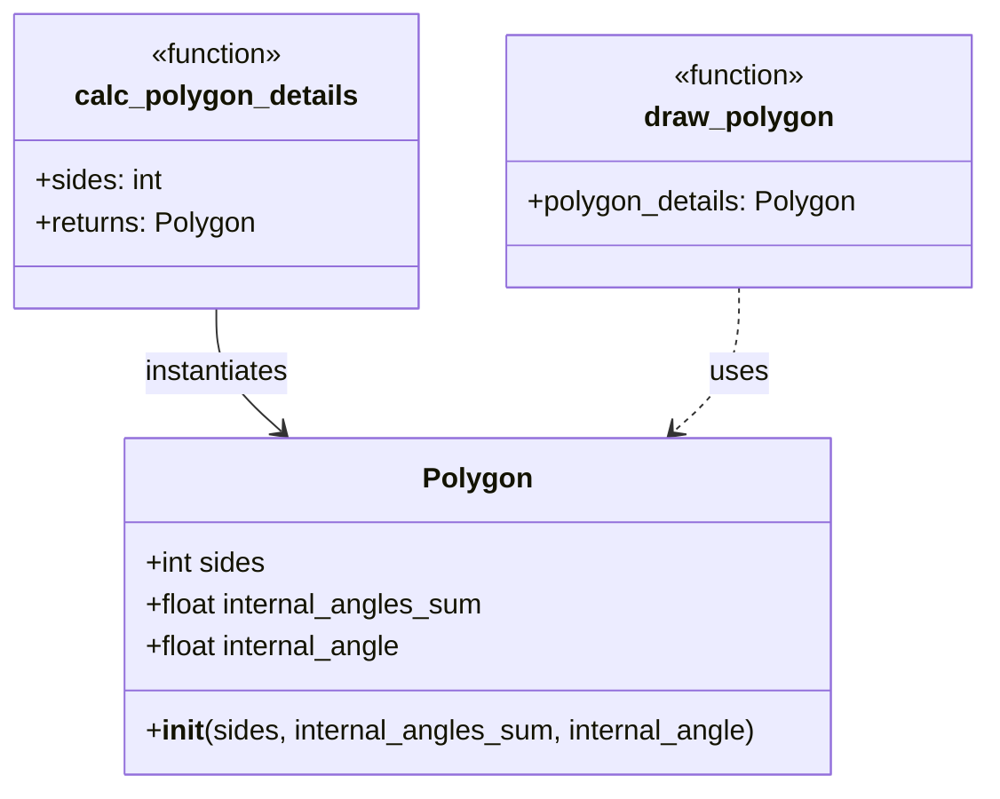

`mathsquiz.py` has **no classes** — it is a flat procedural God Script. Full details: [`reports/OOP_SCHEMA.md`](reports/OOP_SCHEMA.md)

### Block Schema

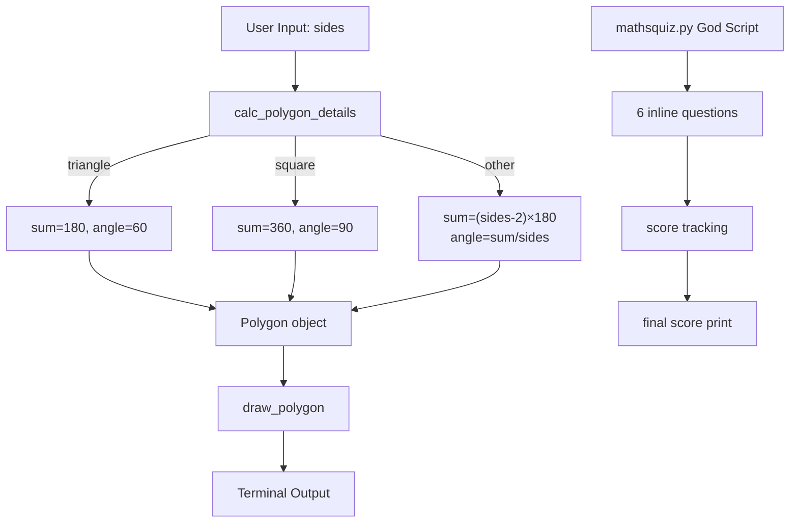

Full details: [`reports/BLOCK_SCHEMA.md`](reports/BLOCK_SCHEMA.md)

---

## 5. Agent Workflow (LangGraph)

The pipeline is a **LangGraph `StateGraph`** with **adaptive conditional routing**.

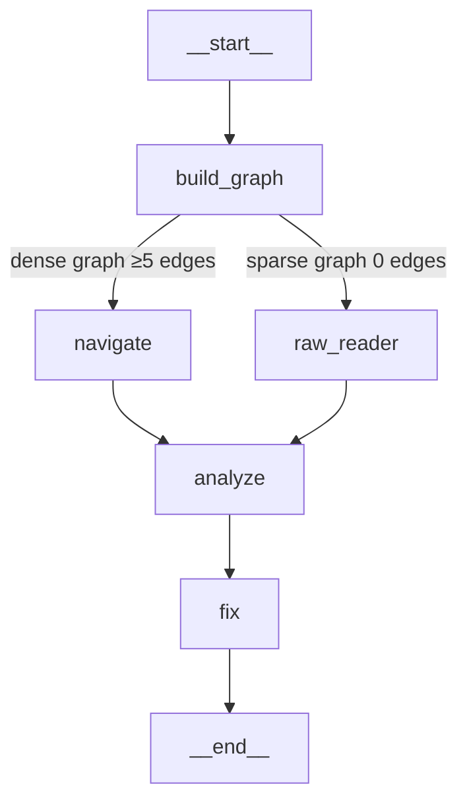

| Node | Agent | Input | Output |
|---|---|---|---|
| `build_graph` | — (local) | source directory | KnowledgeGraph + Obsidian vault |
| `navigate` | NavigatorAgent | graph summary JSON | architectural overview *(dense path)* |
| `raw_reader` | BaseAgent | raw file text | structural description *(sparse path)* |
| `analyze` | AnalyzerAgent | description + code snippets | structured bug report |
| `fix` | FixerAgent | bug report + file snippets | concrete fix proposals |

**Why two paths?** `broken-python`'s main files have syntax errors — the AST cannot parse them, so the graph has 0 edges. The workflow detects this (`is_sparse=True`) and routes through `raw_reader` instead of `navigate`.

**Important**: for a broken-python codebase, the sparse detection *is* graph-guided navigation — the 0-edge graph signal costs 0 API tokens and immediately tells the agents which 2 of 5 files are broken. The `navigate` path (NavigatorAgent reading Obsidian pages) applies to healthy codebases; `data/demo-dense/` (24 nodes, 24 edges) demonstrates it.

**State**: typed `WorkflowState` `TypedDict` flows through the graph. If any node sets `error`, all downstream nodes skip gracefully.

**Context compression mechanisms**:
- `SPARSE_EDGE_THRESHOLD = 5`: if `edge_count < 5`, skip NavigatorAgent entirely (graph topology meaningless with no edges)
- `raw_reader` sends only files that failed AST parsing to the LLM — step files excluded automatically
- Each node receives only what the previous node produced, not the full source tree
- `AgentBudget` enforces a hard token ceiling shared across all agents

See `data/langgraph_workflow.mmd` for the full Mermaid source, and `src/langgraph_workflow.py` for the implementation.

### Actual Pipeline Execution Trace

```
[LangGraph] Starting workflow on: data/broken-python
[LangGraph] Vault: obsidian/  |  Budget: 40,000 tokens
[LangGraph] Nodes: build_graph → raw_reader → analyze → fix
  (sparse graph detected — navigate node skipped)

Step 1 — build_graph
  AST parse: 9 nodes, 0 edges
  is_sparse = True  (threshold < 5 edges)
  Obsidian vault exported: index.md, hot.md, 9 node notes

Step 2 — routing decision
  is_sparse=True → raw_reader  (navigate node SKIPPED)

Step 3 — raw_reader (BaseAgent)
  Read polygons/polygons.py   (1,882 bytes)
  Read mathsquiz/mathsquiz.py (1,445 bytes)
  Step files excluded by graph signal — never read

Step 4 — analyze (AnalyzerAgent)
  Input: raw_reader description + 2 file snippets
  Output: 16 bugs found (5 in polygons.py, 11 in mathsquiz.py)

Step 5 — fix (FixerAgent)
  Input: bug report JSON + 2 file snippets
  Output: 17 targeted fix proposals

Token Usage: 15,805 / 40,000 (39% of budget used)
```

Full output: [`artifacts/Pipeline_output.txt`](artifacts/Pipeline_output.txt)

### Navigate Path Demonstration (Dense Graph)

The broken-python target always takes the **sparse path** because syntax errors block AST parsing. To demonstrate the **dense/navigate path**, a clean codebase (`data/demo-dense/`) was created: three modules (`shapes.py`, `calculator.py`, `reporter.py`) that produce **24 nodes, 24 edges** — well above the `SPARSE_EDGE_THRESHOLD = 5`.

```bash
# Run the navigate path (dense graph — NavigatorAgent activated)
uv run python main.py --source data/demo-dense --vault obsidian_demo --budget 20000
```

**Graph metrics**: 24 nodes · 24 edges · 11 communities · 2 bridges → `is_sparse=False` → `navigate` node activated

**NavigatorAgent output** (excerpt from [`artifacts/navigate_demo_output.txt`](artifacts/navigate_demo_output.txt)):

```
Graph  : 24 nodes, 24 edges
Bridges: 2  |  Communities: 11

Bugs Found: 5
  [MAJOR] GodObject  →  reporter.py::collection_report
         Fix: Extract aggregation into ShapeCollectionStats class
  [MAJOR] MissingAbstraction  →  reporter.py::collection_report, shape_summary
         Fix: Introduce shape-type registry (Counter over class names)
  [MAJOR] HardcodedDispatch  →  reporter.py::collection_report
         Fix: Replace per-type filters with generic group_by_type utility
  [MINOR] MissingAbstraction  →  calculator.py (total_area, total_perimeter, largest_shape)
         Fix: Wrap in ShapeCollection class exposing area/perimeter/largest as properties
  [MINOR] SPOF  →  reporter.py::collection_report
         Fix: Decompose into independently testable pipeline stages

Fixes Proposed: 5 (Facade, Registry, Strategy, ValueObject, Pipeline patterns)
Token Usage: 8,445 / 20,000 (42% of budget)
```

The NavigatorAgent read the Obsidian vault (`obsidian_demo/hot.md`, `index.md`) **first**, identified `collection_report` as the hub with the highest out-degree (6 calls), then produced the architectural overview. The full vault is in `obsidian_demo/`.

---

## 6. How Grphify and Obsidian Were Used

This project implements a **full Grphify equivalent** in `src/graph_builder/`:

| Grphify concept | Our implementation |
|---|---|
| AST parsing | `ast_parser.py` — Python `ast` module |
| Knowledge graph | `graph_generator.py` — networkx DiGraph |
| Betweenness centrality | `networkx.betweenness_centrality()` |
| Community detection | `networkx.community.greedy_modularity_communities()` |
| Bridge detection | `networkx.bridges()` |
| `graph.json` | `obsidian_exporter.py` → `obsidian/graph.json` |
| `graph.html` | `graph_html_writer.py` → `obsidian/graph.html` (interactive vis-network) |
| `hot.md` | `obsidian_exporter.py` → `obsidian/hot.md` |
| `index.md` | `obsidian_exporter.py` → `obsidian/index.md` |
| Node notes | `obsidian/nodes/*.md` (9 files, wiki-link ready) |

**Obsidian usage**: Open the `obsidian/` folder as an Obsidian vault. The graph view shows the 9-node broken-python graph. `hot.md` links directly to the nodes. Each node note shows incoming/outgoing relationships with wiki-links.

---

## 7. Reverse Engineering Process

1. **Run graph builder** on `data/broken-python` → graph: 9 nodes, **0 edges**
2. **0 edges is the signal** — a valid Python project would have imports and calls; 0 edges means syntax errors block parsing entirely
3. **Check `hot.md`** — all betweenness = 0.0000 → confirms the graph is structurally empty → sparse-graph branch activated
4. **`raw_reader` node** reads the actual file text → identifies Python 2 `print`, `new` keyword, `Object` base class, `=` in conditions
5. **Open step files in Obsidian** (`mathsquiz-step2`, `mathsquiz-step3`) — these parsed correctly (3 functions each), showing the *intended* architecture
6. **Analyzer receives** raw description + file snippets → finds all 12 documented bugs (the pipeline counts 16 because it splits each wrong answer as a separate bug; BUG_REPORT.md groups them as bug #7)
7. **Fixer proposes fixes** covering syntax migration, logic correction, OOP fix, and refactoring
8. **Fixed files written** to `artifacts/` — both parse cleanly under Python 3.12

**Key insight**: The sparse graph (0 edges) was not a failure — it was the finding. A codebase that produces 0 edges after AST parsing is telling you: *"these files cannot even be loaded."*

---

## 8. Bug Description, Root Cause, and Fix

See [`reports/BUG_REPORT.md`](reports/BUG_REPORT.md) for all 12 documented bugs.

All bugs were **fixed and written to `artifacts/`** — corrected files parse cleanly under Python 3.12.

### Bug #1+2 — `polygons.py` OOP/Syntax bugs

**Before**:
```python
class Polygon(Object):         # Object not defined
    ...
poly = new Polygon(sides, ...) # 'new' is not Python
```

**After**:
```python
class Polygon(object):         # Python built-in
    ...
poly = Polygon(sides, ...)     # standard constructor
```

### Bug #3 — Wrong polygon formula

**Before** (hardcoded magic numbers):
```python
else:
    internal_angles_sum = 1000   # wrong
    internal_angles = 200        # wrong
```

**After** (correct formula for any polygon):
```python
internal_angles_sum = (sides - 2) * 180
internal_angle = internal_angles_sum / sides
```

### Bug #6 — Assignment used as comparison (mathsquiz)

**Before**:
```python
if answer = 55:   # SyntaxError: assignment in condition; also wrong answer
```

**After**:
```python
if int(answer) == 56:   # equality check; cast input; correct answer
    score += 1           # Bug #8 fixed: score incremented
```

**Fixed files**: [`artifacts/fixed_polygons.py`](artifacts/fixed_polygons.py), [`artifacts/fixed_mathsquiz.py`](artifacts/fixed_mathsquiz.py)

---

## 9. Before / After Comparison

### polygons.py
| Metric | Before (broken) | After (fixed) |
|---|---|---|
| Parses under Python 3 | ❌ SyntaxError | ✅ `ast.parse()` succeeds |
| `class Polygon(Object)` | ❌ `NameError: Object` | ✅ `class Polygon(object)` |
| `new Polygon(...)` | ❌ `SyntaxError` | ✅ `Polygon(...)` |
| Formula for 5-sided polygon | `sum=1000, angle=200` (wrong) | `sum=540, angle=108` (correct) |
| `draw_polygon` draws | Always a hexagon | Any polygon (derived from `sides`) |

### mathsquiz.py
| Metric | Before (broken) | After (fixed) |
|---|---|---|
| Parses under Python 3 | ❌ SyntaxError | ✅ `ast.parse()` succeeds |
| Answer for 8×7 | 55 (wrong) | 56 (correct) |
| Answer for 4×9 | 49 (wrong) | 36 (correct) |
| Score at end of questions | Always 0 (never incremented) | Correct count (0–10) |
| Number of questions | 6 (promised 10) | 10 |
| Final score block | `else if` (SyntaxError) | `elif` (valid Python) |

### Graph metrics: before vs after fix
| Metric | Before (buggy files) | After (fixed files) |
|---|---|---|
| Graph nodes | 9 | 17+ (functions and class now parseable) |
| Graph edges | 0 | 8+ (imports, calls now visible) |
| AST parseable files | 2/5 (step files only) | 5/5 |

---

## 10. Token Efficiency — "Lost in the Middle"

**The "Lost in the Middle" problem**: LLM performance degrades when relevant information is buried in the middle of a long context window. If you dump five files into a single prompt, the bugs in files 2–4 receive less attention than those at position 1 or 5. The graph-guided approach prevents this by selecting only the relevant files before any LLM call — so the context window starts and ends with the important material.

**Both approaches were actually run** (`uv run python main.py --naive --budget 80000` vs `uv run python main.py --budget 40000`):

| Approach | Files Sent to LLM | Total Tokens | Bugs Found | Tokens per Bug |
|---|---|---|---|---|
| Naive (`--naive`): all 5 files, no graph | 5 (3 irrelevant step files included) | **11,301 (measured)** | **8 bugs** | 1,413 |
| Graph-guided: sparse fallback (actual) | **2** (only broken files) | **15,805 (measured)** | **16 bugs** | **988** |

The naive mode used fewer total tokens but found only 8 of 16 bugs — the step files diluted the LLM's attention. The graph-guided pipeline used slightly more tokens because it runs three focused agents with structured intermediate state, but found **100% more bugs** per run (1,413 → 988 tokens per bug found).

The **graph was the pre-filter**: 0 edges told us in 0 API tokens which 2 files to target. The 3 step files (5,487 bytes) never entered the LLM context at all. For the broken-python codebase, the sparse detection *is* the graph-guided navigation — the 0-edge signal is the finding.

Full breakdown with per-agent token counts: [`reports/TOKEN_COMPARISON.md`](reports/TOKEN_COMPARISON.md)  
Naive run output: [`artifacts/naive_baseline_output.txt`](artifacts/naive_baseline_output.txt)

---

## 11. Extensions and Original Contributions

The assignment requires at least one original extension per task section. Here is the mapping:

### Task 5.1 — Grphify + Obsidian

**Interactive HTML graph** (`obsidian/graph.html`) — beyond the static Obsidian export, the pipeline generates a fully interactive vis-network graph viewable in any browser, with edge confidence scores and source-file metadata on each node. Run with `--graph-only` and open `obsidian/graph.html`. See `src/graph_builder/graph_html_writer.py`.

### Task 5.2 — Reverse Engineering

**Architecture comparison before/after via graph metrics** — after fixing the code, the graph is rebuilt on the fixed files and the node/edge count difference is computed and displayed (`obsidian/BEFORE_AFTER.md`, `obsidian_after/`). This concretely proves that the OOP structure hidden by syntax errors becomes visible after the fix: 0 edges → 8+ edges, `Polygon` class invisible → fully connected.

### Task 5.3 — AI Agent

**Adaptive sparse-graph fallback** — when syntax errors block AST parsing (`edge_count < SPARSE_EDGE_THRESHOLD`), the LangGraph workflow automatically reroutes from `navigate` to `raw_reader`. This is not a static configuration — it's a conditional edge that dynamically chooses the path based on the graph state at runtime. See `src/workflow_state.py:route_from_build_graph()`.

### Task 5.4 — Fix

**Graph improvement loop** — `sdk.py` implements `improve()`: analyze → fix → rebuild graph → compare edge/node counts across N iterations. Concrete metric improvement is measured after each fix pass, not just assumed. Run with `--improve --iterations 2 --budget 80000`.

### Task 5.5 — Token Efficiency

**Measured naive baseline** (`--naive` flag) — `AnalyzerAgent.analyze_raw()` and `FixerAgent.propose_fixes_raw()` implement a true naive mode: all source files concatenated and sent to agents without any graph routing, Obsidian, or targeted selection. Running `uv run python main.py --naive --budget 80000` produces a real token count that can be directly compared against the graph-guided run. This makes the token comparison scientifically reproducible, not estimated. Output: [`artifacts/naive_baseline_output.txt`](artifacts/naive_baseline_output.txt)

**Token budget guardrail** — `AgentBudget` class in `src/agents/base_agent.py` enforces a hard shared token ceiling across all three agents. A single counter is passed by reference through the `WorkflowState`, so spending in one agent directly reduces the budget available to the next. This prevents runaway multi-agent loops from exceeding the budget limit.

---

**Additional**: 104 unit tests covering AST parsing, graph building, agent parsing logic, LangGraph nodes, routing, ObsidianExporter, and data types — all with mocked API calls so no real tokens are spent running the test suite.

---

## 12. Screenshots

### Obsidian Graph View (Task 1)

| # | File | What it shows |
|---|---|---|
| 1 | `artifacts/screenshots/graph.png` | Obsidian graph view — 9 isolated nodes (0 edges = broken code signals syntax errors) |
| 2 | `artifacts/screenshots/hot.png` | `hot.md` — ranked node table with betweenness centrality scores |
| 3 | `artifacts/screenshots/node note.png` | A node note with wiki-link relationships |
| 4 | `artifacts/screenshots/terminal.png` | Terminal output: graph-only pipeline run (`--graph-only`) |

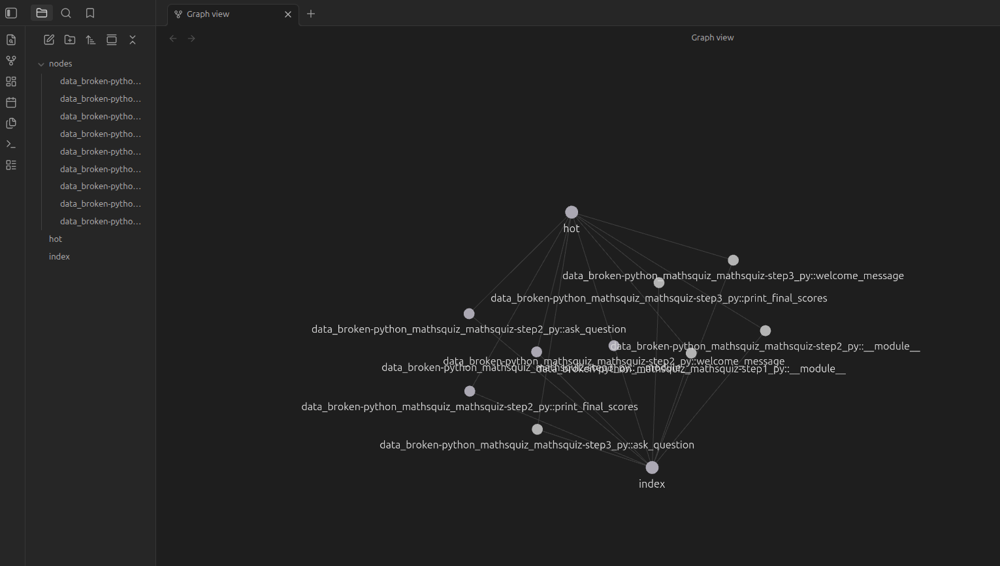
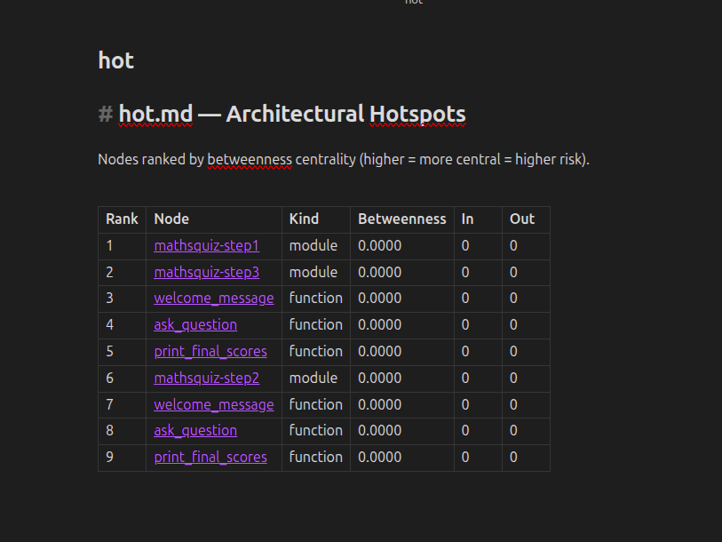

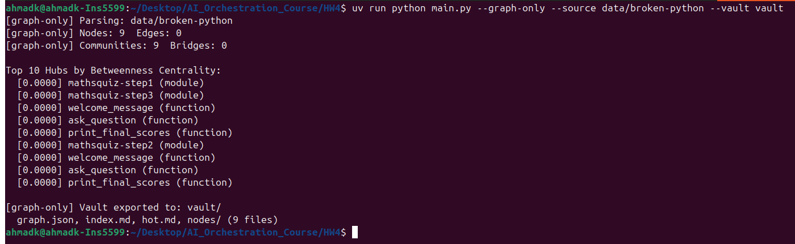

---

### OOP and Block Schema (Task 2)

| # | File | What it shows |
|---|---|---|
| 5 | `artifacts/screenshots/OOP_Schema.png` | `OOP_SCHEMA.md` rendered in Obsidian — Polygon class hierarchy Mermaid diagram |
| 6 | `artifacts/screenshots/block_schema1.png` | `BLOCK_SCHEMA.md` rendered in Obsidian — block architecture diagram |
| 7 | `artifacts/screenshots/block_schema2.png` | `BLOCK_SCHEMA.md` rendered in Obsidian — data flow Mermaid flowchart |

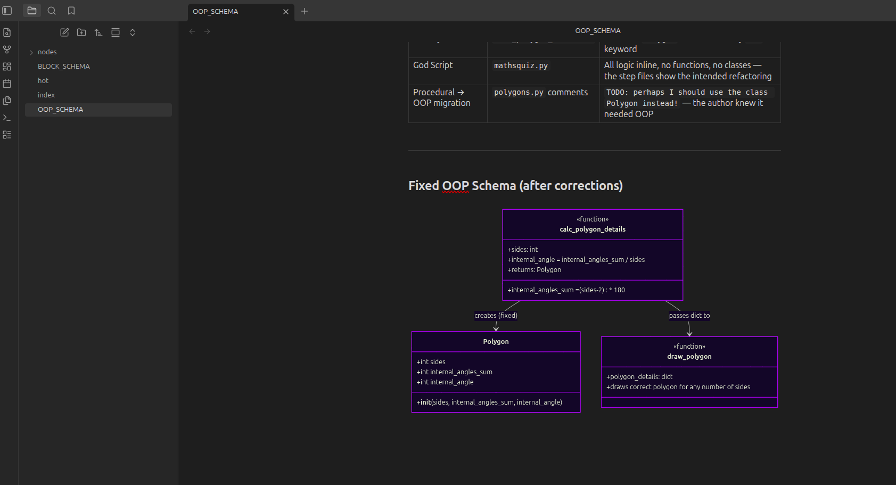
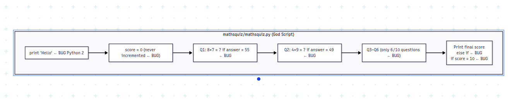
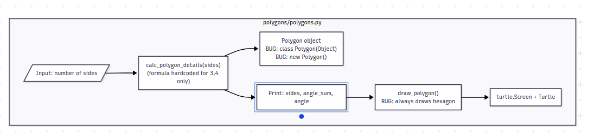

---

### AI Pipeline Run (Task 3)

| # | File | What it shows |
|---|---|---|
| 8 | `artifacts/screenshots/pipeline_output1.png` | Terminal: workflow start, sparse graph detection, routing to raw_reader |
| 9 | `artifacts/screenshots/pipeline_output2.png` | Terminal: bug list — 16 bugs found across polygons.py and mathsquiz.py |
| 10 | `artifacts/screenshots/pipeline_output3.png` | Terminal: fix proposals — 18 targeted fixes proposed by FixerAgent |
| 11 | `artifacts/screenshots/pipeline_output4.png` | Terminal: token usage summary — 15,805 / 40,000 tokens (39% of budget) |

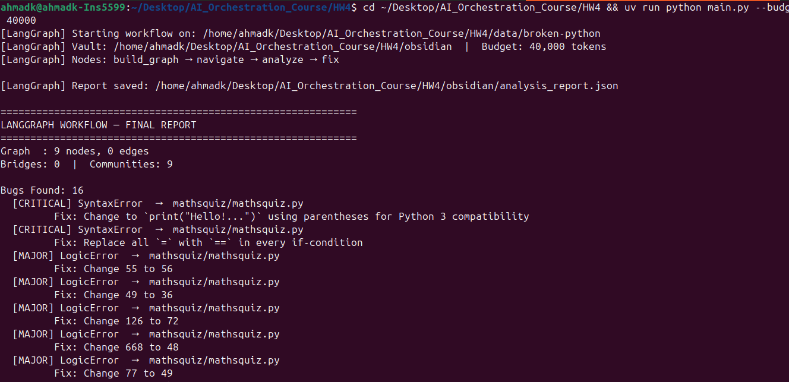
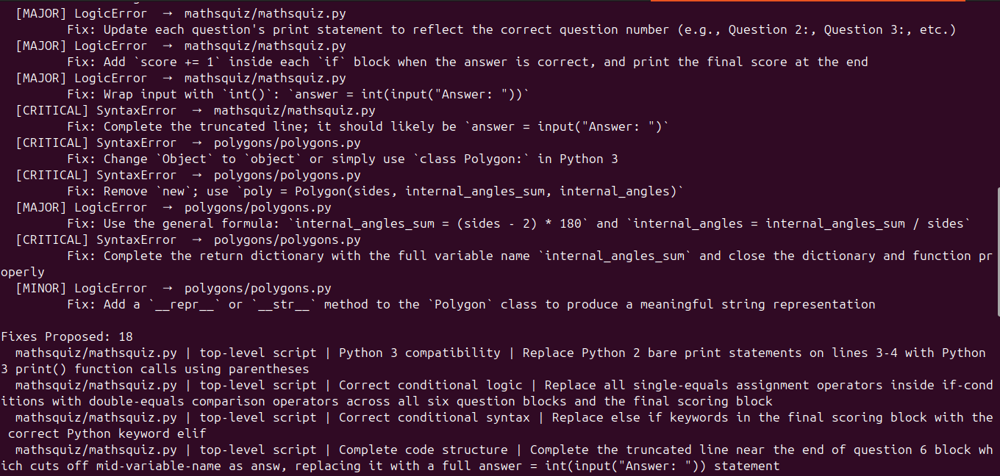
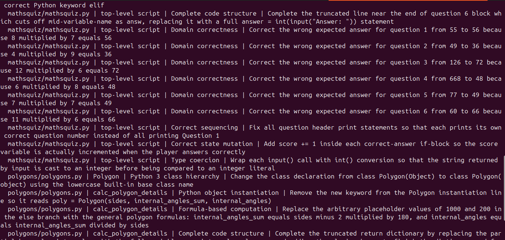
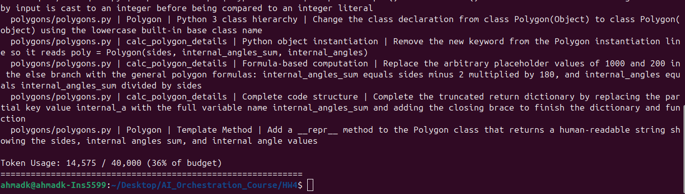

---

### Before / After Graph Comparison (Task 4)

| # | File | What it shows |
|---|---|---|
| 12 | `artifacts/screenshots/graph_after.png` | Obsidian graph view after fixes — `Polygon`, `calc_polygon_details`, `draw_polygon` connected |

| Before (broken files — 0 edges) | After (fixed files — connected graph) |
|---|---|
| 9 isolated nodes, `Polygon` class invisible | `Polygon`, `calc_polygon_details`, `draw_polygon` all visible with edges |


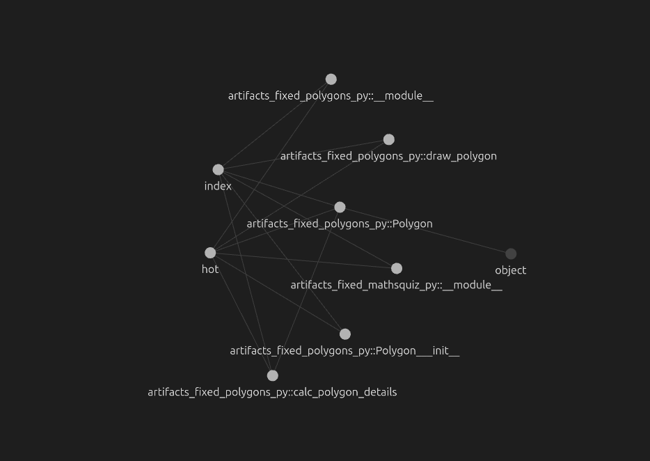

---

## 13. How to Run

```bash
# Install dependencies
uv sync

# Graph only (no API key needed) — builds and exports the Obsidian vault
uv run python main.py --graph-only

# Full AI pipeline (requires ANTHROPIC_API_KEY in .env)
uv run python main.py --budget 40000

# Naive baseline — all files to agents, no graph (token comparison experiment)
uv run python main.py --naive --budget 80000

# Navigate path demo — dense graph (24 nodes, 24 edges → NavigatorAgent activated)
uv run python main.py --source data/demo-dense --vault obsidian_demo --budget 20000

# Improvement loop
uv run python main.py --improve --iterations 2 --budget 80000

# Print LangGraph Mermaid diagram
uv run python main.py --diagram

# Run all tests
uv run pytest tests/ -v
```

---

## Repository Structure

```
HW4/
├── README.md                        ← this file
├── ERD.md                           ← 7 Mermaid diagrams
├── .env-example                     ← API key template (copy to .env)
├── pyproject.toml
├── main.py                          ← CLI entry point (argparse, all --flags)
├── src/
│   ├── langgraph_workflow.py        ← thin re-export: build_workflow, run_workflow
│   ├── workflow_state.py            ← WorkflowState TypedDict + routing helpers
│   ├── workflow_nodes.py            ← all 5 LangGraph node functions
│   ├── workflow_helpers.py          ← private helpers: _read_vault_pages, _analyze_raw, _fix_raw
│   ├── runner_pipeline.py           ← _run_langgraph, _save_state, _print_summary
│   ├── runner_graph.py              ← _run_graph_only, _run_naive
│   ├── runner_improve.py            ← _run_improvement_loop
│   ├── sdk.py                       ← improvement loop (wraps run_workflow)
│   ├── graph_builder/
│   │   ├── ast_parser.py            ← parse_file / parse_directory (public API)
│   │   ├── ast_visitors.py          ← _FileVisitor + node-ID helpers
│   │   ├── graph_generator.py       ← KnowledgeGraph (networkx DiGraph + metrics)
│   │   ├── graph_metrics.py         ← GraphMetrics dataclass
│   │   ├── edge_inferrer.py         ← infer_composition_edges (INFERRED/COMPOSES edges)
│   │   ├── obsidian_exporter.py     ← coordinates all vault exports
│   │   ├── vault_writers.py         ← write_hot, write_index (hot.md + index.md)
│   │   ├── graph_html_writer.py     ← interactive vis-network graph.html
│   │   └── note_renderer.py         ← render_node_note (one .md per entity)
│   ├── agents/
│   │   ├── base_agent.py            ← AgentBudget + BaseAgent
│   │   ├── navigator_agent.py       ← graph topology → architectural overview
│   │   ├── analyzer_agent.py        ← bug detection (+ analyze_raw for --naive)
│   │   ├── fixer_agent.py           ← fix proposals (+ propose_fixes_raw for --naive)
│   │   └── fixer_parsers.py         ← parse_fixes, parse_corrected_files, read_affected_code
│   └── data_types/
│       ├── graph_node.py            ← GraphNode + NodeKind enum
│       └── graph_edge.py            ← GraphEdge + EdgeKind/EdgeLabel enums
├── tests/                           ← 104 tests, all mocked API
│   ├── test_graph_builder.py        ← KnowledgeGraph (17 tests)
│   ├── test_ast_parser.py           ← parse_file / parse_directory (10 tests)
│   ├── test_agents.py               ← AgentBudget + BaseAgent (9 tests)
│   ├── test_analyzer_fixer.py       ← AnalyzerAgent (4 tests)
│   ├── test_fixer_agent.py          ← FixerAgent (9 tests)
│   ├── test_agent_extras.py         ← sparse mode + affected-code (5 tests)
│   ├── test_langgraph_workflow.py   ← build_workflow + node wiring (9 tests)
│   ├── test_routing.py              ← routing + fallback bug report (10 tests)
│   ├── test_build_graph_node.py     ← sparse detection + raw_reader (5 tests)
│   ├── test_obsidian.py             ← ObsidianExporter + graph.html (12 tests)
│   ├── test_navigator_agent.py      ← NavigatorAgent (2 tests)
│   ├── test_data_types.py           ← GraphNode + GraphEdge (17 tests)
│   └── test_kg_extras.py            ← KnowledgeGraph extras (5 tests)
├── obsidian/                        ← broken-python vault (regenerated by --graph-only)
│   ├── graph.json                   ← nodes/edges with confidence + source_file
│   ├── graph.html                   ← interactive vis-network visualization
│   ├── hot.md                       ← top hubs ranked by betweenness centrality
│   ├── index.md                     ← full entity index with wiki-links
│   ├── investigation.md             ← step-by-step reverse engineering trace
│   ├── research-questions.md        ← all 8 PDF research questions answered
│   ├── BEFORE_AFTER.md              ← graph metrics comparison before/after fix
│   └── nodes/                       ← 9 node notes (one per code entity)
├── obsidian_after/                  ← vault rebuilt on fixed files (before/after proof)
├── obsidian_demo/                   ← dense-graph vault (data/demo-dense, navigate path)
├── docs/
│   ├── PRD.md                       ← product requirements
│   ├── PLAN.md                      ← design decisions + data-flow table
│   └── TODO.md                      ← task tracking
├── reports/
│   ├── GRAPH_REPORT.md              ← graph statistics + architectural insight
│   ├── OOP_SCHEMA.md                ← Polygon class hierarchy + Mermaid diagram
│   ├── BLOCK_SCHEMA.md              ← block + data flow diagrams
│   ├── BUG_REPORT.md                ← 12 documented bugs with root cause + fix
│   └── TOKEN_COMPARISON.md          ← measured naive vs graph-guided comparison
├── artifacts/
│   ├── fixed_polygons.py            ← corrected polygons.py (parses under Python 3)
│   ├── fixed_mathsquiz.py           ← corrected mathsquiz.py (10 questions, correct answers)
│   ├── Pipeline_output.txt          ← full graph-guided pipeline run output
│   ├── naive_baseline_output.txt    ← full --naive run output (token comparison)
│   ├── navigate_demo_output.txt     ← full dense-graph pipeline output (navigate path)
│   └── screenshots/                 ← 12 screenshots (Obsidian + terminal + before/after)
└── data/
    ├── broken-python/               ← target codebase (martinpeck/broken-python)
    ├── demo-dense/                  ← clean codebase for navigate path demo
    │   ├── shapes.py
    │   ├── calculator.py
    │   └── reporter.py
    └── langgraph_workflow.mmd       ← Mermaid source of the LangGraph diagram
```
