# Block Schema — broken-python System Architecture

---

## High-Level Block Diagram

```
broken-python/
│
├── polygons/polygons.py          ← OOP program (broken)
│    │
│    ├── [INPUT]  sides = int(input("How many sides?"))
│    │
│    ├── calc_polygon_details(sides)
│    │    ├── if sides == 3 → sum=180, angle=60
│    │    ├── if sides == 4 → sum=360, angle=90
│    │    └── else          → sum=1000, angle=200  ← BUG (wrong formula)
│    │         └── new Polygon(...)                ← BUG (Java syntax)
│    │
│    ├── [OUTPUT] print polygon details
│    │
│    └── draw_polygon(polygon_details)
│         └── turtle draws hexagon always          ← BUG (hardcoded)
│
└── mathsquiz/mathsquiz.py        ← God Script (broken)
     │
     ├── [INPUT]  print "Hello..."                 ← BUG (Python 2)
     ├── score = 0
     │
     ├── Question 1: 8×7 → if answer = 55         ← BUG (= not ==, wrong answer)
     ├── Question 2: 4×9 → if answer = 49         ← BUG (= not ==, wrong answer)
     ├── Question 3: 12×6 → if answer = 126       ← BUG (= not ==, wrong answer)
     ├── Question 4: 6×8 → if answer = 668        ← BUG (= not ==, wrong answer)
     ├── Question 5: 7×7 → if answer = 77         ← BUG (= not ==, wrong answer)
     ├── Question 6: 11×6 → if answer = 60        ← BUG (= not ==, wrong answer)
     │   [only 6 questions, promised 10]           ← BUG
     │   [score never incremented]                 ← BUG
     │
     └── [OUTPUT]
          ├── if score < 5   → "practice maths"
          ├── else if score < 8 → "pretty good"   ← BUG (else if, not elif)
          └── else if score = 10 → "maths star"   ← BUG (= not ==)
```

---

## Mermaid Block Diagram

```mermaid
flowchart TD
    subgraph polygons["polygons/polygons.py"]
        I1[/"Input: number of sides"/]
        CPD["calc_polygon_details(sides)\n(formula hardcoded for 3,4 only)"]
        P["Polygon object\nBUG: class Polygon(Object)\nBUG: new Polygon()"]
        OP["Print: sides, angle_sum, angle"]
        DP["draw_polygon()\nBUG: always draws hexagon"]
        T["turtle.Screen + Turtle"]

        I1 --> CPD
        CPD --> P
        CPD --> OP
        OP --> DP
        DP --> T
    end

    subgraph mathsquiz["mathsquiz/mathsquiz.py (God Script)"]
        G1["print 'Hello' ← BUG Python 2"]
        S["score = 0 (never incremented ← BUG)"]
        Q1["Q1: 8×7 = ? if answer = 55 ← BUG"]
        Q2["Q2: 4×9 = ? if answer = 49 ← BUG"]
        Q3["Q3–Q6 (only 6/10 questions ← BUG)"]
        FIN["Print final score\nelse if ← BUG\nif score = 10 ← BUG"]

        G1 --> S --> Q1 --> Q2 --> Q3 --> FIN
    end
```



---

## Intended Architecture (after refactoring)

The `mathsquiz-step2.py` and `mathsquiz-step3.py` files show the professor's intended refactoring:

```
mathsquiz-step2.py (intended structure)
 ├── welcome_message()          ← extracted from inline code
 ├── ask_question(q, answer)    ← extracted per-question logic
 └── print_final_scores(score)  ← extracted final block

mathsquiz-step3.py (further refactoring)
 └── same 3 functions, cleaner implementation
```

---

## Data Flow

```
polygons.py:
  User input (sides)
    └─► calc_polygon_details()
          └─► Polygon object (sides, angle_sum, angle)
                └─► print details
                      └─► draw_polygon() → turtle screen

mathsquiz.py:
  [no input — questions hardcoded]
    └─► 6 question blocks (inline)
          └─► answer = input()
                └─► if answer = WRONG_VALUE  ← assignment not comparison
                      └─► print Correct/Wrong
    └─► print final score (always 0 — score never incremented)
```

---

## Architectural Hotspots

| Block | Issue | Severity |
|-------|-------|----------|
| `mathsquiz.py` (entire file) | God Script — no functions, no OOP, all inline | Major |
| `calc_polygon_details()` | Hardcoded formulas, only handles 3 and 4 sides | Major |
| `draw_polygon()` | Ignores `polygon_details["sides"]`, always draws hexagon | Major |
| `class Polygon(Object)` | Wrong base class, `new` keyword — Java/JS influence | Critical |
