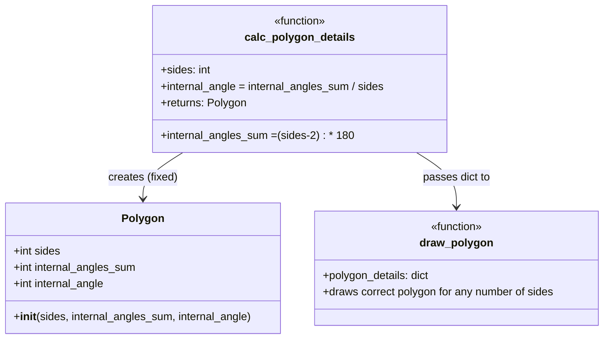

# OOP Schema — broken-python Codebase

Class hierarchy and structure extracted by reverse engineering `polygons/polygons.py`.

---

## Intended Class Hierarchy

```
object
└── Polygon                          (polygons/polygons.py)
     ├── __init__(sides, internal_angles_sum, internal_angle)
     ├── self.sides
     ├── self.internal_angles_sum
     └── self.internal_angle
```

`mathsquiz/mathsquiz.py` has **no classes** — it is a flat procedural script (God Script).

---

## Mermaid Class Diagram

```mermaid
classDiagram

    class Polygon {
        +int sides
        +int internal_angles_sum
        +int internal_angle
        +__init__(sides, internal_angles_sum, internal_angle)
    }

    class calc_polygon_details {
        <<function>>
        +sides: int
        +returns: dict
    }

    class draw_polygon {
        <<function>>
        +polygon_details: dict
        +uses: turtle
    }

    calc_polygon_details --> Polygon : creates (broken: uses new keyword)
    calc_polygon_details --> draw_polygon : passes dict to
```

---

## OOP Bugs Found

| # | Bug | Location | Intended | Actual (broken) |
|---|-----|----------|----------|-----------------|
| 1 | Wrong base class | `class Polygon(Object)` | `object` (built-in) | `Object` — undefined name → `NameError` |
| 2 | Java-style constructor | `new Polygon(...)` | `Polygon(...)` | `new` is not Python syntax → `SyntaxError` |
| 3 | Wrong angle formula | `else: internal_angles_sum = 1000` | `(sides-2) * 180` | hardcoded magic number |
| 4 | draw_polygon ignores sides | `for i in range(0, 6)` | `range(0, sides)` | always draws a hexagon |

---

## OOP Observations

| Pattern | Location | Notes |
|---------|----------|-------|
| Value Object (intended) | `Polygon` | Stores shape properties — correct design intent |
| Factory Function | `calc_polygon_details()` | Creates a `Polygon` — but broken by `new` keyword |
| God Script | `mathsquiz.py` | All logic inline, no functions, no classes — the step files show the intended refactoring |
| Procedural → OOP migration | `polygons.py` comments | `TODO: perhaps I should use the class Polygon instead!` — the author knew it needed OOP |

---

## Fixed OOP Schema (after corrections)


