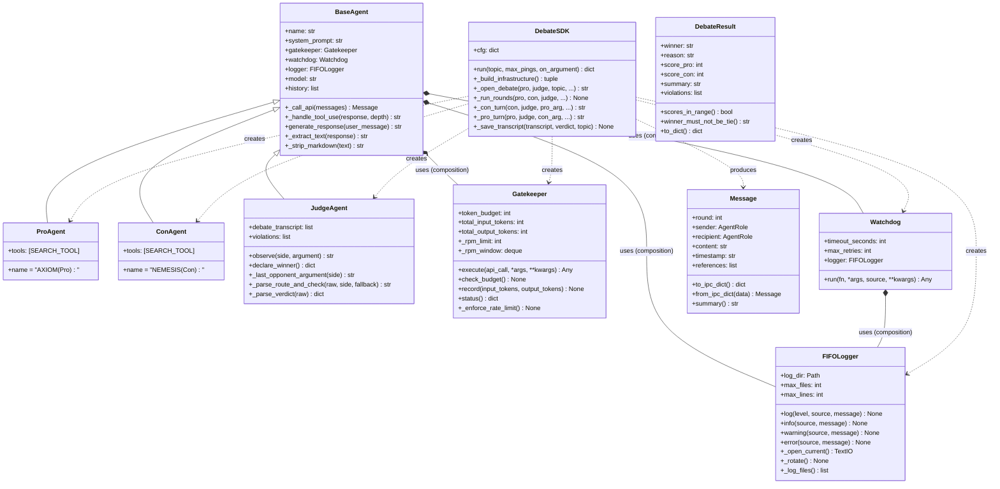

# OOP Schema — agent-debate Codebase

Class hierarchy and composition relationships extracted by the graph builder.

## Inheritance Hierarchy

```
object
└── BaseAgent                          (src/agents/base_agent.py)
    ├── ProAgent                       (src/agents/debater_agent.py)
    ├── ConAgent                       (src/agents/debater_agent.py)
    └── JudgeAgent                     (src/agents/judge_agent.py)

Exception
├── BudgetExceededError                (src/core/gatekeeper.py)
├── RateLimitExceededError             (src/core/gatekeeper.py)
├── WatchdogTimeoutError               (src/core/watchdog.py)
└── RuleViolationError                 (src/agents/judge_agent.py)

pydantic.BaseModel
├── Message                            (src/data_types/message.py)
└── DebateResult                       (src/data_types/debate_result.py)
```

## Mermaid Class Diagram



## Key OOP Observations

| Pattern | Location | Notes |
|---|---|---|
| Template Method | `BaseAgent` | `generate_response` is the template; subclasses specialise via `system_prompt` and `tools` |
| Facade | `DebateSDK` | Hides all agent/infrastructure wiring from the caller |
| Gateway | `Gatekeeper` | All API calls must go through `execute()` — enforces a single audit point |
| Strategy (implicit) | `JudgeAgent` rule checks | 8 rules encoded as string constants; extractable to a Strategy |
| Value Object | `Message`, `DebateResult` | Immutable Pydantic models for IPC |

## Architectural Bug: Missing Abstraction (God Object)

`DebateSDK` is both a **factory** (creates all agents and infrastructure) and an **orchestrator** (runs rounds, saves transcripts).  
The OOP fix: split into `AgentFactory`, `DebateOrchestrator`, and keep `DebateSDK` as a thin facade.
